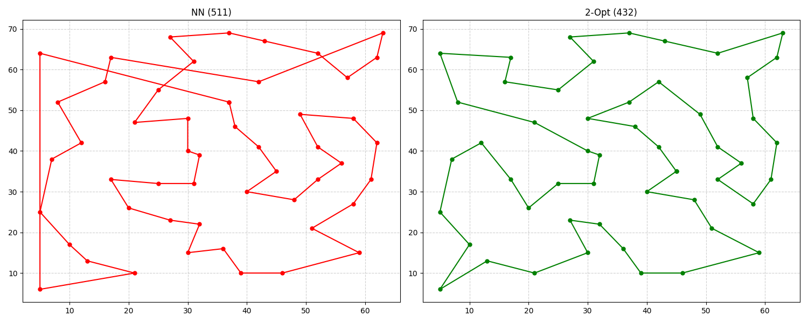

# Desafio de Estágio - Laboratório Galgos (PUC-Rio)
## Solução para o Problema do Caixeiro-Viajante (TSP)

Este repositório contém a solução técnica para o desafio do **Laboratório Galgos**. O foco foi construir um código modular, escalável e rigorosamente alinhado aos padrões da **TSPLib 95**.

---

## Metodologia e Estrutura

Para garantir o rigor técnico, configurei um **Agente Personalizado (Gemini)** como copiloto, alimentado com o manual da TSPLib e princípios de **SOLID**. 

Utilizei o **Strategy Pattern** para permitir a troca fácil entre algoritmos. Isso garante que o carregamento dos dados seja independente da lógica de resolução, permitindo escalabilidade para novos métodos de otimização.

> **Transparência:** A conversa e o uso da IA para estruturar o projeto podem ser conferidos aqui: []

---

## Evolução dos Resultados (Instância eil51)

Abaixo, a progressão da solução desde a baseline até a meta-heurística:

| Algoritmo | Distância Obtida | Ótimo (TSPLib) | Gap (%) |
| :--- | :--- | :--- | :--- |
| Nearest Neighbor (Baseline) | 511 | 426 | ~19,9% |
| Nearest Neighbor + 2-Opt | 441 | 426 | ~3,5% |
| **NN + 2-Opt + Simulated Annealing** | **432** | 426 | **~1,4%** |

### Análise Experimental e Estocasticidade
Ao contrário dos métodos determinísticos, o **Simulated Annealing (SA)** apresentou variações nos resultados (432, 441, 437) devido à sua natureza probabilística. O resultado de **432** prova que o algoritmo teve "energia" suficiente para escapar de ótimos locais onde o 2-Opt ficaria retido.

#### Tabela de Sensibilidade de Parâmetros (Tuning)

| Configuração | Temp. Inicial (T) | Alpha (α) | Resultado Médio | Observação Técnica |
| :--- | :--- | :--- | :--- | :--- |
| Padrão | 100 | 0.99 | 441 | Convergência prematura (Ótimo Local). |
| **Ajuste Final** | **500** | **0.9999** | **432** | Resfriamento lento permitiu exploração global. |

---

## Desafios Técnicos: O "Erro de Ouro"

Durante a implementação, identifiquei um **Indexing Offset Mismatch**:
- **O Problema:** `IndexError: index 51 out of bounds`. As instâncias da TSPLib são *1-based*, enquanto o NumPy em Python é *0-based*.
- **A Solução:** Intervi manualmente no código para implementar uma normalização de índices. Esse ajuste garantiu a integridade referencial entre a matriz de adjacência e os IDs oficiais.

---

## Uso de IA Generativa (Copiloto Técnico)

Em conformidade com o edital, utilizou-se o **Gemini (Google)** como ferramenta de auxílio:
- **IA:** Estruturação da arquitetura (Strategy Pattern), geração de boilerplate e revisão de normas técnicas.
- **Candidato:** Correção manual do erro de indexação, validação dos cálculos `EUC_2D`, **Hyperparameter Tuning** do Simulated Annealing e análise crítica de convergência.

---

## Como executar
1. Instale as dependências: `pip install -r requirements.txt`
2. Execute o script principal: `python3 main.py`

---
## Visualização das Rotas

*Comparativo entre a baseline (NN) e a solução otimizada (SA), evidenciando a remoção de cruzamentos e a redução do custo total.*
